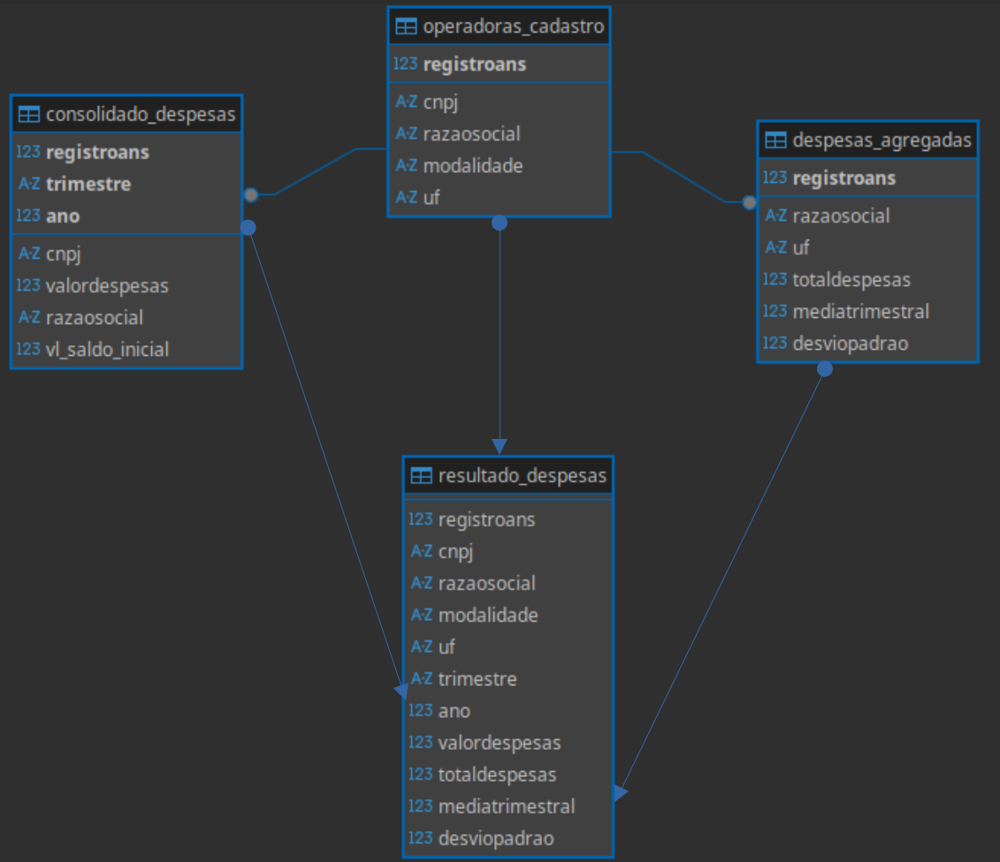
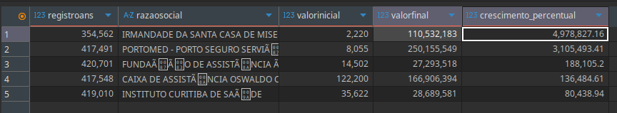
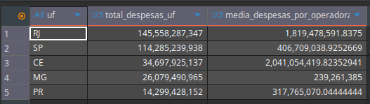
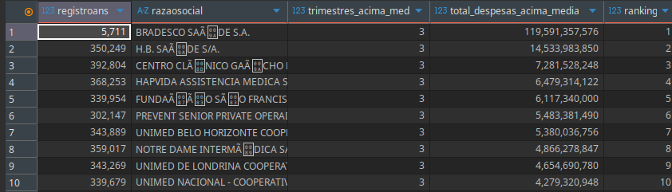

# 🏥 Teste_ANS – Integração com API Pública da ANS

[](https://www.python.org/)
[](https://www.postgresql.org/)


> Implementação da
s Etapas 1 , 2, 3 e 4 do teste técnico da ANS: integração com API pública, normalização, consolidação, validação, enriquecimento, análise de dados e interface web.

---

## **📋 Descrição do Projeto**

Este projeto implementa um pipeline de processamento de dados (ETL) dividido em quatro etapas fundamentais:

1. **Extração (`main.py`)**
   - Navega no FTP da ANS e identifica os 3 trimestres mais recentes.
   - Realiza o download e extração de arquivos ZIP em memória.
   - Consolida os dados brutos iniciais.
    🚨 Os arquivos baixados nao possuem o campo CNPJ, então, compilei em arquivo unico com a coluna CNPJ vazia para enriquecimento posterior.

2. **Tratamento e Utilidades (`src/utils.py`)**
   - **Validação de CNPJ:** Algoritmo de cálculo de dígitos verificadores para garantir a integridade dos dados.
   - **Normalização:** Mapeia diversos nomes de colunas (ex: `REG_ANS`, `REGISTRO_OPERADORA`) para um padrão único.
   - **Limpeza:** Converte formatos de moeda (vírgula para ponto), trata valores negativos e remove registros inconsistentes.

3. **Transformação e Enriquecimento (`transform.py`)**
   🚨 Percebendo que o campo comum entre os arquivos é o Registro ANS, este foi priorizado até o fim do projeto. E, utilizando este campo como ancora, foi possivel buscar o CNPJ faltante na etapa anterior.
   - **Cruzamento de Dados (Merge):** Combina os dados financeiros com o Relatório CADOP (Cadastro de Operadoras ativas).
   - **Análise Estatística:** Análise Estatística: Calcula o total de despesas, média trimestral e desvio padrão por operadora.
   - **Deduplicação Inteligente:** Identifica e corrige casos onde o mesmo CNPJ apresenta nomes diferentes, mantendo o registro mais atualizado.
   - **Compactação dos três arquivos em:** `Teste_Caroline_Alexandre.zip`

```
|------------------------------------|--------------------------------------------------------------------|
|Arquivo                             |  Descrição                                                         |
|------------------------------------|--------------------------------------------------------------------|
|consolidado_despesas.csv            -> Dados financeiros brutos dos últimos 3 trimestres.                |
|tabela_cadastro_operadoras_limpo.csv-> Cadastro de operadoras ativo e sanitizado.                        |
|despesas_agregadas.csv              -> Resultado Final: Visão executiva com totais e estatísticas por UF.|
|------------------------------------|--------------------------------------------------------------------|
```

4. **API e Interface Web (Etapa 4)**
    🚨 Este foi meu primeiro contato com Vue.js, dependeu de muita pesquisa e do apoio de IA para o desenvolvimento
   - Backend em **FastAPI** fornecendo rotas para operadoras, detalhes, histórico e estatísticas.
   - Frontend em **Vue.js** exibindo tabela paginada, busca/filtro, gráficos e modal de detalhes.

## **🛠 Tecnologias e Bibliotecas**

- **Linguagem:** Python 3.12, JavaScript (Vue.js 2)
- **Bibliotecas Python:** `pandas`, `fastapi`, `uvicorn`, `pydantic`, `requests`
- **Bibliotecas JS:** `axios`, `vue`, `chart.js`
- **Banco de Dados:** PostgreSQL > 10 
- **Ferramenta de Banco de Dados:** [DBeaver](https://dbeaver.io/)
- **Modelagem:** Relacional com Chaves Estrangeiras (FK)

---

## **📂 Estrutura de Pastas**

```text
Teste_Caroline_Alexandre/
│
├── src/                    # ETAPAS 1 e 2 (pipeline)
│   ├── main.py             # Ingestão (Etapa 1)
│   ├── transform.py        # Enriquecimento e agregações (Etapa 2)
│   └── utils.py
│
├── api/                    # ETAPA 4 (backend web)
│   └── main.py             # FastAPI (servidor)
│
├── frontend/               # ETAPA 4 (Vue.js)
│   └── index.html
│
├── img/                    # ETAPA 3 (ResultadosQuery)
│
│
├── postman/                # ETAPA 4
│   └── postman_operadoras.json
│
├── db/                     # ETAPA 3
│   ├── create_tables.sql
│   ├── load_data.sql
│   └── analytics.sql
│
├── data/                   # CSVs gerados (ignorado pelo Git)
│
├── requirements.txt
├── .gitignore
└── README.md
```

---

## **🚀 Como Executar**

1. Criar virtual environment:

```bash
python3 -m venv venv
source venv/bin/activate
pip install -r requirements.txt

```

2. Processamento de Dados (ETAPAS 1 e 2)

```bash
python src/main.py #python -m src.main
python src/transform.py
```

3. Banco de Dados (ETAPA 3)
    - Execute o script db/create_tables.sql no PostgreSQL.
    - Importe os CSVs (Cadastro primeiro, depois Despesas).
    - Exporte `resultado_despesas.csv` para a pasta `data`.  

4. API e Frontend (ETAPA 4)
Rodar backend
```bash
cd Teste_Caroline_Alexandre
uvicorn api.main:app --reload
```

Abrir frontend
```bash
cd frontend
# abrir index.html no navegador (Chrome ou Firefox)
``` 


## ETAPA 4 – API e Frontend
``` 
| Componente                | Escolha          | Justificativa                                            |
|---------------------------|------------------|----------------------------------------------------------|
| Backend Framework         | FastAPI          | Performance, validação automática, documentação integrada|
| Paginação                 | Offset-based     | Simples, eficiente para dataset < 2k registros           |
| Estatísticas              | Calcular sempre  | Dataset pequeno, simplicidade e consistência             |
| Estrutura de resposta     | Dados + metadados| Facilita frontend e paginação                            |
| Busca/Filtração           | Cliente          | Resposta instantânea, dataset pequeno                    |
| Gerenciamento de estado   | Props/Events     | Simples, suficiente para aplicação pequena               |
| Renderização tabela       | v-for            | Dataset pequeno, sem necessidade de virtual scroll       |
| Erros/loading/dados vazios| Mensagens específicas e loading | Melhor UX e feedback claro                |
```

## 🌐 Funcionalidades da Interface Web

    1. Tabela paginada de operadoras com RegistroANS, Razão Social, UF e TotalDespesas.
    2. Busca instantânea no cliente por RegistroANS, CNPJ ou Razão Social.
    3. Gráfico de distribuição de despesas por UF usando Chart.js.
    4. Modal de detalhes da operadora, exibindo histórico de despesas (Média Trimestral e Desvio Padrão).
    5. Tratamento de erros e loading: mensagens claras e feedback visual.    

## 📊 Resultados Finais - Querys - Analytics.sql
    - Optou-se por manter valores monetários como 'dado bruto' para evitar possiveis conflitos com conversão em moeda ou algo semelhante.
    
**1. 5 operadoras com maior crescimento percentual de despesas (...)**

    - Identificação do primeiro trimestre e o último trimestre de cada operadora ou do dataset.
    - Calcular o valor total de despesas em cada um desses trimestres.
    - Calcular o crescimento percentual:

Crescimento (%) = 
\[
\frac{\text{Valor Final} - \text{Valor Inicial}}{\text{Valor Inicial}} \times 100
\]
	​
    - Tratar casos onde a operadora não tenha dado em algum trimestre:
    - Solução: considerar somente operadoras que tenham dados em ambos os trimestres.
    - Justificativa: sem dados em algum trimestre, o crescimento percentual não pode ser calculado corretamente.




**2. Distribuição de Despesas por UF**
A tabela mostra os 5 estados com maiores despesas totais, considerando todas as operadoras.
Além do total de despesas por estado, também é apresentada a média de despesas por operadora, permitindo comparar o impacto médio de cada operadora em cada UF.



**3. Operadoras acima da média**
### Ranking de Operadoras Acima da Média

Esta análise mostra quais operadoras tiveram despesas **acima da média em pelo menos 1 trimestre** e cria um ranking baseado em dois critérios:

1. **Número de trimestres acima da média** – quanto maior, melhor o desempenho da operadora.
2. **Total de despesas acima da média** – usado para desempatar entre operadoras com o mesmo número de trimestres acima da média.

A tabela resultante permite identificar facilmente as operadoras com **desempenho consistente acima da média** ao longo dos trimestres analisados.




## 📝 Documentação da API

- **Coleção Postman incluída:** `/docs/postman_collection.json.`
Contém exemplos de requisições para todas as rotas, incluindo paginação, filtros, detalhes e estatísticas.

- **Testes de API**
`http://127.0.0.1:8000/api/operadoras?page=1&limit=5`<br>
`http://127.0.0.1:8000/api/operadoras?page=1&limit=50&q={{termo_busca}}`<br>
`http://127.0.0.1:8000/api/operadoras/{{registro_ans}}`<br>
`http://127.0.0.1:8000/api/operadoras/{{registro_ans}}/despesas`<br>
`http://127.0.0.1:8000/api/estatisticas/crescimento`<br>
`http://127.0.0.1:8000/api/estatisticas/despesas_uf`<br>
`http://127.0.0.1:8000/api/estatisticas/acima_media`


## 👩‍💻 Autora
- Caroline Alexandre  
- [GitHub](https://github.com/Carolalx)